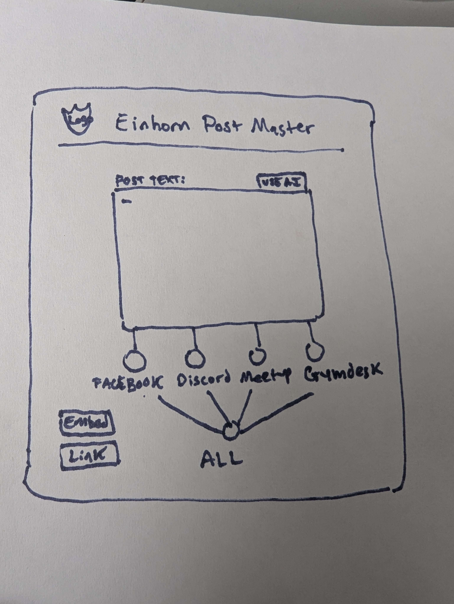

# Einhorn Postmaster

A mini-app for the **Einhorn** martial arts club that lets you compose a post once and publish it to Discord, Facebook, Meetup, and Gymdesk — with AI-assisted refinement via Gemini.



## Features

- **Rich text editor** with bold, italic, underline, lists, and alignment
- **Refine with AI** — sends draft text to a configurable Gemini gem and returns polished HTML
- **Four platform buttons** — post individually to Facebook, Discord, Meetup, or Gymdesk
- **Send to All** — publishes to every platform at once
- **Confirmation dialog** before any send
- **Live status feedback** — spinner while awaiting confirmation, green checkmark on success, red X with error details on failure
- **Share tools** — copy a direct link or iframe embed code
- **Responsive design** — dark grey, hunter green, and gold color scheme with Germania One (title) and Oldenburg (body) fonts

## Live App

Once GitHub Pages is enabled, the app will be available at:

**https://gparrine.github.io/einhorn_post_master/**

## Quick Start (Local Preview)

**Easiest way — one command from the repo root:**

```bash
git checkout cursor/einhorn-postmaster-b8ba   # if not already on this branch
npm run install:all                           # first time only
npm run dev
```

Then open **http://localhost:5173** in your browser.

This starts both the frontend and backend together. Demo mode is enabled by default, so you can test AI refine and posting without API keys.

### Manual setup (two terminals)

**Terminal 1 — Backend API**

```bash
cd backend
cp .env.example .env    # first time only
npm install             # first time only
npm run dev
```

The API runs on **http://localhost:3001**.

**Terminal 2 — Frontend**

```bash
cd frontend
npm install             # first time only
npm run dev
```

Open **http://localhost:5173**. The Vite dev server proxies `/api` requests to the backend.

### Production-style preview

```bash
# Terminal 1: backend (still required for buttons/AI to work)
cd backend && npm run dev

# Terminal 2: build + preview
npm run preview         # from repo root
```

Open **http://localhost:4173**.

## Troubleshooting preview

| Problem | Fix |
|---|---|
| Blank page or red Vite error about logo PNG | Make sure `frontend/src/assets/einhorn_logo_yellow_on_transparent_large.png` exists, then restart the dev server |
| `npm run dev` fails at repo root (old setup) | Use the new root command above, or `cd frontend` first |
| Buttons / AI do nothing | Backend must be running on port 3001 in a separate terminal |
| `EADDRINUSE` port already in use | Stop old servers (`Ctrl+C`) or run `lsof -ti:5173,3001 \| xargs kill` |
| Changes not showing | Hard refresh the browser (`Ctrl+Shift+R`) or restart `npm run dev` |
| GitHub Pages URL 404 | Merge the PR to `main` and enable Pages (Settings → Pages → GitHub Actions) |

## Configuration

Copy `backend/.env.example` to `backend/.env` and fill in your credentials:

| Variable | Description |
|---|---|
| `GEMINI_API_KEY` | Google AI Studio API key for "Refine with AI" |
| `GEMINI_SYSTEM_PROMPT` | Optional custom prompt matching your Gemini gem |
| `DISCORD_BOT_TOKEN` | Discord bot token with message permissions |
| `DISCORD_CHANNEL_ID` | Target channel ID |
| `FACEBOOK_ACCESS_TOKEN` | Page/group access token with `publish_to_groups` |
| `FACEBOOK_GROUP_ID` | Facebook group ID |
| `MEETUP_API_KEY` | Meetup OAuth bearer token |
| `MEETUP_GROUP_URLNAME` | Meetup group URL slug |
| `GYMDESK_API_KEY` | Gymdesk API key |
| `GYMDESK_LOCATION_ID` | Gymdesk location ID |
| `DEMO_MODE` | Set `false` when real credentials are configured |

Set `DEMO_MODE=false` once your API keys are in place.

### Meetup date matching

When posting to Meetup, the app looks for a date in your post text and matches it to an upcoming group event. Include a clear date such as **June 24, 2026** or **6/24/2026**.

## Deployment

### Frontend (GitHub Pages)

1. Enable GitHub Pages for this repo (Settings → Pages → Source: **GitHub Actions**)
2. Optionally set a repository variable `VITE_API_URL` to your deployed backend URL
3. Push to `main` — the workflow builds and deploys automatically

### Backend

Deploy the `backend/` folder to any Node.js host (Render, Railway, Fly.io, etc.):

```bash
cd backend
npm install
npm run build
npm start
```

Set all environment variables from `.env.example` on your host, and add your GitHub Pages URL to `ALLOWED_ORIGINS`.

For production frontend builds, set:

```bash
VITE_API_URL=https://your-api-host.example.com npm run build
```

## Logo

The Einhorn logo is at `frontend/src/assets/einhorn_logo_yellow_on_transparent_large.png`.

## Project Structure

```
├── frontend/          React + Vite UI (GitHub Pages)
├── backend/           Express API (platform integrations)
├── design/            Design assets and sketch
└── .github/workflows/ CI and GitHub Pages deployment
```

## Embed

Use the **Embed** button in the app to copy an iframe snippet, or embed directly:

```html
<iframe
  src="https://gparrine.github.io/einhorn_post_master/"
  width="480"
  height="720"
  frameborder="0"
  style="border-radius:12px;border:1px solid #355E3B;"
  title="Einhorn Postmaster">
</iframe>
```
